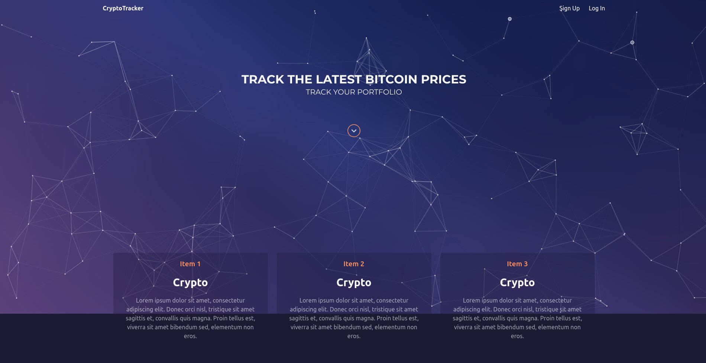

# Crypto
## https://spduk-crypto.herokuapp.com/
### Hosted using heroku so it might take 10 seconds to load

> Putting it aside for now, the cryptocurrency API is incredibly slow sometimes taking up to 50 seconds to make a single fetch. Everything works as it should but the API is sometimes just slow.

> You can sign up and add/remove coins, it shows the price of each and  It doesn't redirect after you login (because of router problems with rails) so you have to visit your profile from the navbar.

Friends list is fake and does nothing.


___
Ruby version: 2.5.1
Node version 10.8.0

Some things are installed as dependencies not devDependencies because heroku was being weird.

To make it run locally: ``` bundle install``` to install ruby gems, then to install react modules ```cd client`` and run ```yarn install``` or ```npm instal```

To start the dev server ```bin/rake start``` or you can manually start the server with ```bin/rails s -p 3001``` and to start the client ```yarn --cwd client start```


To add the top 100 cryptos to the database and run 
There is a function inside seeds.rb that makes an api call to coinmarketcap.

The API is very slow at times, sometimes it will finish loading things instantly and others it could take up to 20 seconds to finish, but it does all work as it should, if the API worked faster there would be no problems at all.
If it takes too long to load then just refresh the page and by magic it might load instantly.
```
bin/rake db:reset
```
